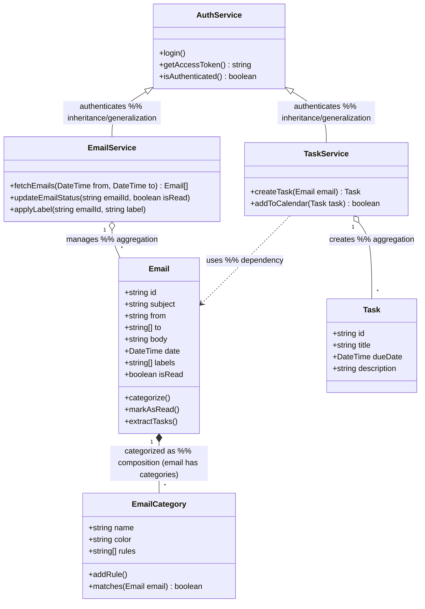
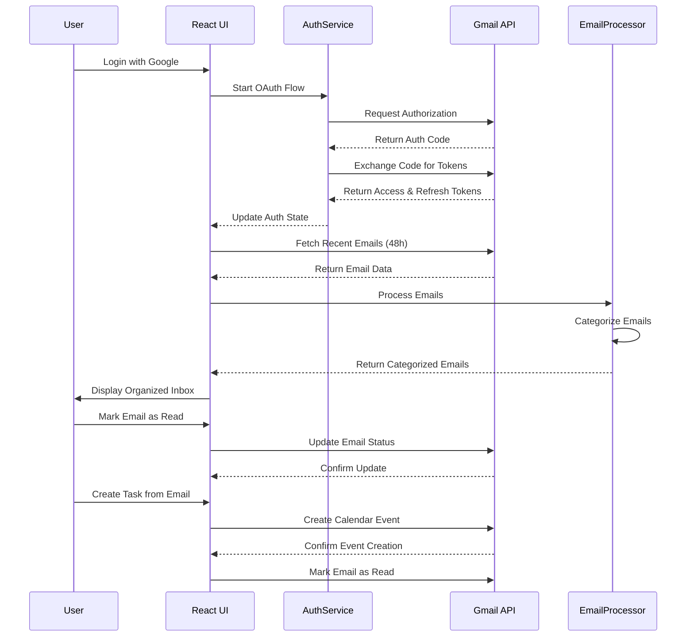
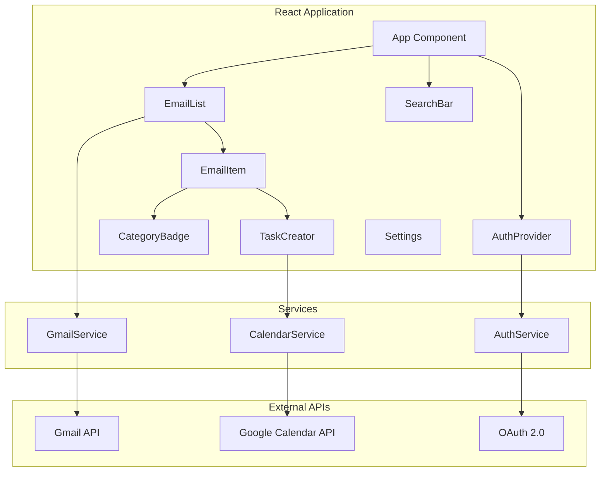
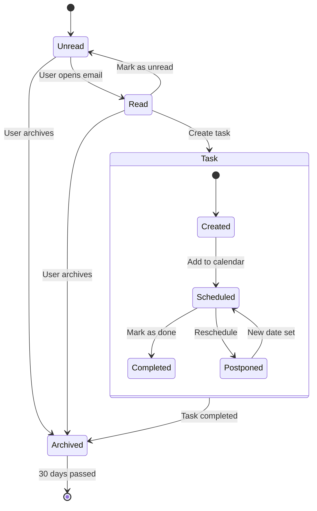
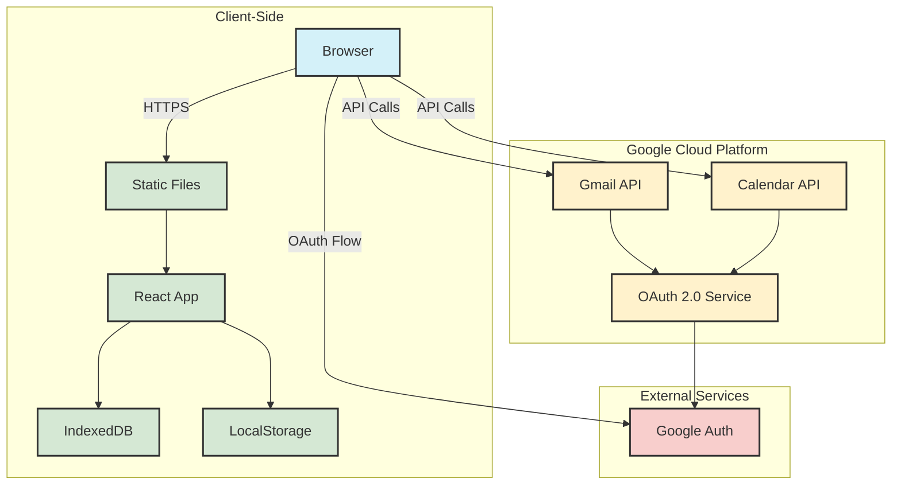

# Email Sparkle Sorter: UML Diagrams

## 1. Use Case Diagram
```mermaid
%% Use Case Diagram with <<include>> and <<extend>> relationships
%% Actors: User, Gmail OAuth, Google Calendar
%% Use cases: Authenticate, View Emails, Categorize Emails, Create Task, Mark as Read/Unread, Search & Filter

actor User
actor "Gmail OAuth" as OAuth
actor "Google Calendar" as Calendar

User --> (Authenticate)
(Authenticate) --> OAuth : <<include>>
User --> (View Emails)
(View Emails) --> (Categorize Emails) : <<include>>
(View Emails) --> (Search & Filter)
User --> (Categorize Emails)
(Categorize Emails) --> (Mark as Read/Unread) : <<extend>>
User --> (Create Task)
(Create Task) --> Calendar : <<include>>
(Create Task) --> (Mark as Read/Unread) : <<include>>
User --> (Mark as Read/Unread)
User --> (Search & Filter)

%% Notes:
%% - <<include>> means the base use case always invokes the included use case
%% - <<extend>> means the base use case may optionally invoke the extended use case
```

## 2. Class Diagram


## 3. Sequence Diagram - Email Processing


## 4. Component Diagram


## 5. State Diagram - Email Lifecycle


## 6. Deployment Diagram


## How to Use These Diagrams

1. **Use Case Diagram**: Shows the main functionalities of the system from the user's perspective.
2. **Class Diagram**: Illustrates the system's classes, attributes, operations, and relationships.
3. **Sequence Diagram**: Demonstrates the flow of operations for email processing.
4. **Component Diagram**: Shows the organization and dependencies among software components.
5. **State Diagram**: Represents the different states an email can be in throughout its lifecycle.
6. **Deployment Diagram**: Visualizes the system's physical architecture and deployment.

These diagrams use Mermaid.js syntax and can be rendered in any Markdown viewer that supports Mermaid (like GitHub, GitLab, or VS Code with Mermaid extension).
